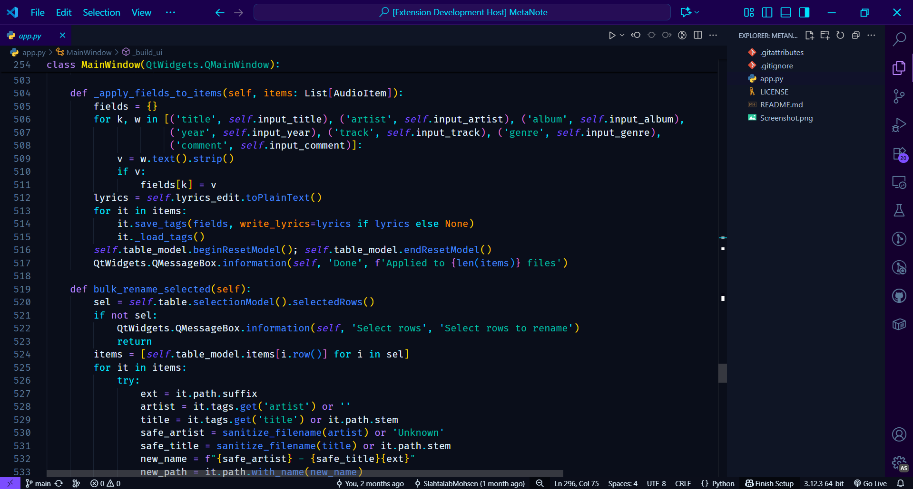

# Miyabi Theme for Visual Studio Code

A refined and elegant theme for Visual Studio Code, inspired by the Japanese concept of "Miyabi" — a timeless aesthetic of grace and sophistication. This dark theme features a striking purple palette as its key color, blended with oceanic blue tones, creating a cyberpunk-inspired yet serene coding environment. Perfect for developers seeking both style and comfort during long coding sessions.

## 🎨 Features

- **Elegant Purple Palette**: Highlights are dominated by rich purples (`#1A004D`, `#BB86FC`) complemented by cyan accents (`#00E5FF`).
- **Comfortable Contrast**: Designed for all-day use with a dark base (`#0A0E1A`) and soft foregrounds (`#E0F2FF`).
- **Customizable UI**: Seamlessly integrates with VS Code's UI, including title bars, tabs, and sidebars, all tailored to the Miyabi aesthetic.
- **Syntax Highlighting**: Enhanced token colors for readability across languages like JavaScript, Python, Markdown, and more.

## 📸 Preview

_Experience the elegance of Miyabi in action._

## 🚀 Installation

1. Open Visual Studio Code.
2. Go to the Extensions view (`Ctrl+Shift+X` or `Cmd+Shift+X` on Mac).
3. Search for "Miyabi Theme" and install it.
4. Open the Command Palette (`Ctrl+Shift+P` or `Cmd+Shift+P`) and select "Preferences: Color Theme" > "Miyabi".
5. Reload VS Code to apply the theme.

## 🔧 Customization

To tweak the theme to your liking, modify the `miyabi-color-theme.json` file in the `themes` directory. Adjust colors in the `colors` and `tokenColors` sections to suit your preferences. After editing, reload VS Code to see changes.

## 📝 License

This theme is released under the [MIT License](LICENSE). Feel free to use, modify, and distribute it as you wish.

## 🤝 Contributing

Contributions are welcome! Please fork this repository, make your changes, and submit a pull request. For bugs or feature requests, open an issue.

## 🙏 Acknowledgments

Inspired by the Ayu theme and crafted with love for the coding community. Special thanks to the VS Code team for their extensible platform.

## 🌐 Repository

- Check out the source code and contribute: [https://github.com/SlahtalabMohsen/vscode-theme-miyabi](https://github.com/SlahtalabMohsen/vscode-theme-miyabi)

- Microsoft visual studio code marketplace link : https://marketplace.visualstudio.com/items?itemName=slahtalabmohsen.miyabi-theme

## 👨‍💻 Created By

- Designed and developed by Slahtalab Mohsen.

---

_Last updated: September 26, 2025_
